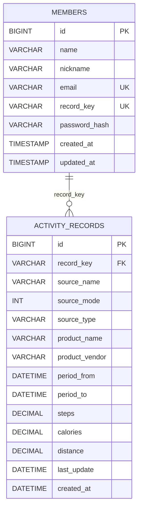

# Health Activity Service

Samsung Health와 Apple Health의 걸음 수·칼로리·거리 데이터를 저장하고, 회원별 일간·월간 합계를 제공하는 Spring Boot API입니다. [샘플 데이터 집계 결과](docs/sample-results.md)에는 제공된 JSON 4개의 일간·월간 조회 결과를 정리했습니다.

## 실행

Java 17과 Docker Desktop이 필요합니다. 프로젝트 루트에서 다음 명령을 실행합니다.

```powershell
docker compose up -d
docker compose exec redis redis-cli ping  # PONG 확인
.\gradlew.bat bootRun
```

기본 실행 주소는 `http://localhost:8080`입니다. Compose는 MySQL 8.4(`localhost:3307`)와 Redis 7.4(`localhost:6379`)를 시작합니다. MySQL 스키마는 앱 시작 시 Flyway가 생성합니다. 기본 DB 비밀번호는 로컬 개발용이며, 다른 환경에서는 `DB_URL`, `DB_USERNAME`, `DB_PASSWORD`, `REDIS_HOST`, `REDIS_PORT`를 설정하세요. HTTPS 배포 시 `SESSION_COOKIE_SECURE=true`도 설정해야 합니다.

Docker CLI에서 `docker info`의 Server 정보를 읽을 수 있어야 Compose가 동작합니다. Docker Desktop 앱이 실행되지 않았다면 먼저 실행해야 합니다.

## API 사용 예시

인증은 서버 세션과 CSRF 토큰을 사용합니다. 회원가입과 로그인에도 CSRF 토큰이 필요하고, 로그인 후에는 토큰을 다시 받아야 합니다. 다음 PowerShell 예시는 같은 웹 세션에서 회원가입·로그인·데이터 저장·조회를 수행합니다.

```powershell
$base = 'http://localhost:8080'
$session = New-Object Microsoft.PowerShell.Commands.WebRequestSession
$csrf = Invoke-RestMethod "$base/api/auth/csrf" -WebSession $session
$headers = @{}
$headers[$csrf.headerName] = $csrf.token

$registration = @{ name='홍길동'; nickname='walker'; email='walker@example.com'; password='ExamplePass123!' } | ConvertTo-Json
$member = Invoke-RestMethod "$base/api/members" -Method Post -WebSession $session -Headers $headers -ContentType 'application/json' -Body $registration

$login = @{ email='walker@example.com'; password='ExamplePass123!' } | ConvertTo-Json
Invoke-RestMethod "$base/api/auth/login" -Method Post -WebSession $session -Headers $headers -ContentType 'application/json' -Body $login
$csrf = Invoke-RestMethod "$base/api/auth/csrf" -WebSession $session
$headers[$csrf.headerName] = $csrf.token

$payload = @"
{
  "recordkey": "$($member.recordkey)",
  "type": "steps",
  "lastUpdate": "2024-12-16 14:40:00 +0000",
  "data": {
    "source": {"name":"SamsungHealth","mode":9,"type":"","product":{"name":"Android","vender":"Samsung"}},
    "entries": [
      {"period":{"from":"2024-11-15 00:00:00","to":"2024-11-15 00:10:00"},
       "steps":54,"calories":{"unit":"kcal","value":2.03},"distance":{"unit":"km","value":0.04223}}
    ]
  }
}
"@
Invoke-RestMethod "$base/api/activities" -Method Post -WebSession $session -Headers $headers -ContentType 'application/json' -Body $payload

Invoke-RestMethod "$base/api/activities/daily?recordKey=$($member.recordkey)&from=2024-11-15&to=2024-11-15" -WebSession $session
Invoke-RestMethod "$base/api/activities/monthly?recordKey=$($member.recordkey)&from=2024-11&to=2024-11" -WebSession $session
```

`email`은 사용하지 않은 주소로 바꾸세요. [샘플 데이터 집계 결과](docs/sample-results.md)를 재현하려면 **파일마다 별도 회원을 생성**하고, 원본 JSON의 `recordkey`를 그 회원에게 발급된 키로 교체해야 합니다. 원본 숫자의 정밀도를 유지하려면 JSON 전체를 재직렬화하지 말고 첫 번째 `recordkey`만 문자열로 교체하세요.

```powershell
# 새 회원으로 로그인한 세션에서 실행; 원본 파일은 공개 저장소에 포함하지 않습니다.
$payload = Get-Content 'C:\project\Test\INPUT_DATA1.json' -Raw -Encoding UTF8
$payload = [regex]::new('"recordkey"\s*:\s*"[^"]+"').Replace($payload, '"recordkey":"' + $member.recordkey + '"', 1)
Invoke-RestMethod "$base/api/activities" -Method Post -WebSession $session -Headers $headers -ContentType 'application/json' -Body $payload
```

서로 다른 샘플을 한 회원에게 연속 저장하면 같은 출처·기간에 값이 충돌할 수 있고, 조회 결과도 회원 기준으로 합산됩니다.

| 메서드 | 경로 | 기능 |
| --- | --- | --- |
| `GET` | `/api/auth/csrf` | CSRF 토큰 발급 |
| `POST` | `/api/members` | 회원가입; 이름·닉네임·이메일·비밀번호 입력 |
| `POST` | `/api/auth/login` | 로그인; 이메일·비밀번호 입력 |
| `GET` | `/api/auth/me` | 로그인 회원 조회 |
| `POST` | `/api/auth/logout` | 로그아웃 |
| `POST` | `/api/activities` | 활동 데이터 저장 |
| `GET` | `/api/activities/daily` | `recordKey`, `from`, `to`로 일간 조회 |
| `GET` | `/api/activities/monthly` | `recordKey`, `from`, `to`로 월간 조회 |

저장 성공 응답은 `{"recordkey":"...","received":1,"inserted":1,"duplicates":0}`입니다. 동일 데이터를 다시 보내면 `inserted`가 0이고 `duplicates`가 증가합니다. 조회 응답은 날짜 오름차순의 `[{"period":"2024-11-15","steps":54,"calories":2.03,"distance":0.04223,"recordkey":"..."}]` 형식입니다. 소수 값의 끝자리 0은 실제 응답에 더 붙을 수 있습니다. 일간 날짜는 `yyyy-MM-dd`, 월간 날짜는 `yyyy-MM`이고 `from`·`to`는 모두 포함합니다. 입력 오류는 400, 인증 실패는 401, 다른 회원의 키 사용은 403, 기존 구간과 값이 다른 재전송은 409를 반환합니다.

## 프로젝트 구성

- `member`: 회원가입, 이메일 정규화, 회원·`recordkey` 관리
- `auth`: 세션 로그인, CSRF, 접근 제어
- `activity`: 입력 정규화·중복 방지 저장, 일간·월간 집계, Redis 캐시
- `common`: API 오류 응답
- `src/main/resources/db/migration`: Flyway 스키마
- `src/test`: 인증·활동·캐시 통합 테스트

## 데이터 모델



`members.email`과 `members.record_key`는 각각 유일합니다. 활동 데이터에는 `(record_key, source_name, period_from, period_to)` 유일 제약으로 중복 저장을 막고, `(record_key, period_from)` 인덱스로 기간 조회를 지원합니다. 세 측정 값은 MySQL `DECIMAL(38,20)`이며, 시각은 UTC `DATETIME(6)`으로 저장합니다. 테이블은 [Flyway 마이그레이션](src/main/resources/db/migration)으로 관리합니다.

| 필드 | 설명 |
| --- | --- |
| `members.id`, `activity_records.id` | 각 테이블의 내부 기본 키 |
| `members.name`, `members.nickname` | 회원 이름과 표시용 닉네임 |
| `members.email`, `members.password_hash` | 로그인 식별자와 PBKDF2 해시 비밀번호 |
| `members.record_key` | 가입 시 발급하는 회원별 UUID; 활동 데이터와 연결하는 유일 키 |
| `activity_records.record_key` | 활동 소유 회원을 가리키는 외래 키; 조회 응답의 `recordkey` |
| `source_name`, `source_mode`, `source_type` | Samsung Health·Health Kit 출처와 입력 메타데이터 |
| `product_name`, `product_vendor` | 수집 단말 정보; `product_vendor`는 원본 입력의 `vender` 값 |
| `period_from`, `period_to` | 활동 시작·종료 시각(UTC); 시작 시각으로 일·월을 정함 |
| `steps`, `calories`, `distance` | 걸음 수, 소모 칼로리(kcal), 이동거리(km) |
| `last_update` | 입력 JSON이 전달한 최종 갱신 시각(UTC) |
| `created_at`, `updated_at` | 행 생성 시각 및 회원 갱신 시각 |

## 처리 규칙과 선택 이유

- 삼성 날짜는 한국 현지 시각, Apple Health 날짜는 입력의 UTC 오프셋으로 해석한 뒤 UTC로 저장합니다. 조회 시 `Asia/Seoul` 기준의 활동 **시작일**로 묶으며 자정을 넘는 항목은 나누지 않습니다.
- 걸음 수의 소수 값은 `BigDecimal`로 모두 합산한 뒤 일·월마다 한 번 `HALF_UP` 반올림합니다. 칼로리와 거리는 반올림하지 않습니다. 서로 다른 출처의 측정 구간이 겹치면 둘 다 합산합니다.
- 같은 회원의 동시 저장은 회원 행 잠금과 DB 유일 제약으로 보호합니다. 같은 구간·같은 값은 중복으로 건너뛰고, 값이 다르면 요청 전체를 409로 거절합니다.
- 조회 캐시는 `recordkey`별로 일간·월간을 분리해 Redis에 5분간 보관합니다. 회원 소유권 확인 후 캐시를 읽고, 새 활동 데이터가 커밋된 뒤 두 캐시를 제거합니다. Redis가 응답하지 않으면 DB에서 조회합니다. 장애 중 무효화에 실패하면 TTL 전까지 이전 결과가 남을 수 있습니다.
- 비밀번호는 PBKDF2 해시로 저장하며 세션은 30분 미사용 시 만료됩니다. 현재 세션은 단일 앱 인스턴스 메모리에 있으므로 재시작 시 로그인이 풀립니다.

Samsung Health와 Health Kit의 날짜·숫자 표현 차이, MySQL 저장 시 JVM 시간대에 따른 UTC 값의 9시간 이동, 저장 커밋과 캐시 무효화의 순서가 주요 구현 이슈였습니다. 입력 경계에서 날짜를 UTC로 통일하고, Hibernate의 `hibernate.type.java_time_use_direct_jdbc=true`로 JDBC 이중 변환을 막았으며, 캐시 제거는 트랜잭션 `afterCommit`에 배치했습니다.

## 테스트

```powershell
.\gradlew.bat test

# 원본 JSON 4개가 C:\project\Test에 있을 때 전체 저장·재전송·집계 검증
$env:HEALTH_SAMPLE_DIR = 'C:\project\Test'
.\gradlew.bat test --rerun-tasks
```

외부 JSON이 없어도 합성 데이터 기반 테스트가 실행됩니다. 원본 파일 테스트는 환경변수를 설정했을 때만 실행하며, 4개 파일의 총 4,710건에 대해 저장·중복 처리·일간·월간 합계를 확인합니다. 기본 통합 테스트는 H2의 MySQL 호환 모드와 Redis 모의 객체를 사용합니다. 별도로 Compose의 MySQL 8.4·Redis 7.4에서 실제 HTTP 저장·조회·캐시 TTL·무효화를 확인했습니다.

`TEST_DB_URL`, `TEST_DB_USERNAME`, `TEST_DB_PASSWORD`로 실제 MySQL 테스트를 실행할 때는 **폐기 가능한 전용 DB만** 지정하세요. 통합 테스트가 회원·활동 데이터를 삭제합니다.
